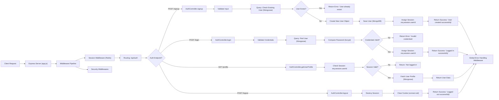

## Demo Video
https://github.com/user-attachments/assets/f212c2af-8467-4143-83ae-e16767e79c32

## Project Structure


```
campusconnect/
├── backend/                   # Express backend code
│   ├── config/
│   │   └── db.js              # MongoDB connection configuration
│   ├── controllers/
│   │   └── authController.js  # Authentication controllers (signup, login, profile)
│   ├── middlewares/
│   │   └── authMiddleware.js  # Protect middleware to verify JWTs
│   ├── models/
│   │   └── User.js            # Mongoose User model
│   ├── routes/
│   │   └── authRoutes.js      # Authentication routes (mounted under /api/auth)
│   ├── Dockerfile.backend     # Dockerfile for the backend
│   └── server.js              # Main server entry point
├── frontend/                  # React frontend code
│   ├── public/
│   ├── src/
│   │   ├── components/        # React components (forms, layout, etc.)
│   │   ├── context/           # AuthContext, etc.
│   │   ├── services/          # API services (authService.js, etc.)
│   │   └── ...                
│   ├── Dockerfile.frontend    # Dockerfile for the frontend
│   └── package.json
├── .env                       # Global environment variables (see below)
├── .env.example               # Example environment variables file
├── docker-compose.yml         # Docker Compose configuration
└── README.md                  # This file
```
### Deployment

1. **Clone the Repository**

   ```
   git clone https://github.com/TylerGeiger513/CloudComputing-Prototype.git
   cd CloudComputing-Prototype
   ```

2. **Create a Global `.env` File**

   Copy the `.env.example` to `.env` and update the values as necessary:

   ```
   cp .env.example .env
   ```

3. **Install Docker and Docker Compose**

   Ensure you have [Docker](https://www.docker.com/get-started) and [Docker Compose](https://docs.docker.com/compose/install/) installed.

4. **Build and Start the Containers**

   Run the following command from the root directory:

   ```
   docker-compose up --build -d
   ```

   This command will:
   - Build the backend and frontend images.
   - Start the MongoDB container.
   - Map ports as specified (backend on port 3000, frontend on port 4200).

5. **Access the Application**
   - **Frontend:** Open your browser and navigate to [http://localhost:4200](http://localhost:4200).
   - **Backend API:** You can test endpoints (e.g., via Postman) at [http://localhost:3000/api/auth](http://localhost:3000/api/auth).


### Planning

## Backend

First Prototype: TODO:

endpoints: 
1. 
profile/
   updateProfile(username, email, campus) -- add an endpoint to allow to change username or email
   changePassword(oldpass, newpass)add an endpoint to allow to change password 


friend/
add endpoints for a functioning friend system. add friend, should work on a basic friend request system

messageContext or other name- 
For first product - just try to get messaging and message history in private DMs. This will later be expanded to have channels in classrooms in 2 so keep it modular ready for expansion with more role based permissions in future use etc...
Later implementations: delete / edit message

2. 

allow for messaging across campus channel
when user signs up - they should join a campus - for now just make it load a list of campuses that we set up for now only focusing on West Chester University and Testing Campus
Each campus should have a general campus discussion channel to focus on for now.
Allow for the creation of classrooms which are similar to campuses where they have a main chatting area for now and an option to invite friends to join
Integrate testing covering 100% of the backend scope
Security audit + overview

### Backend Flowchart


### Frontend Flowchart

```mermaid
flowchart LR
  %% Application Initialization and Session Check
  A["Client Browser"]
  A --> B["Load React App (index.js)"]
  B --> C["AuthProvider (Context)"]
  C --> D["On Mount: fetchUserProfile()"]
  D --> E["API Call: GET /api/auth/profile"]
  E --> F{"Session Exists?"}
  F -- "Yes" --> G["Receive User Profile from Backend"]
  F -- "No" --> H["Receive 'Not logged in' Response"]
  G --> I["AuthContext sets 'user' state"]
  H --> I
  I --> J["React Router (Routes.js)"]
  J --> K{"User Authenticated?"}
  K -- "Yes" --> L["Render Dashboard / Protected Routes"]
  K -- "No" --> M["Render Login Page"]

  %% Login Flow
  M --> N["User fills in Login Form"]
  N --> O["User submits Login Form"]
  O --> P["API Call: POST /api/auth/login"]
  P --> Q["Backend validates credentials, sets session cookie"]
  Q --> R["Browser stores session cookie ('connect.sid')"]
  R --> S["AuthProvider calls fetchUserProfile() again"]
  S --> E

  %% Logout Flow
  L --> T["User clicks Logout Button"]
  T --> U["API Call: POST /api/auth/logout"]
  U --> V["Backend destroys session and clears cookie"]
  V --> W["Browser removes session cookie"]
  W --> X["AuthProvider updates 'user' state to null"]
  X --> J
```

