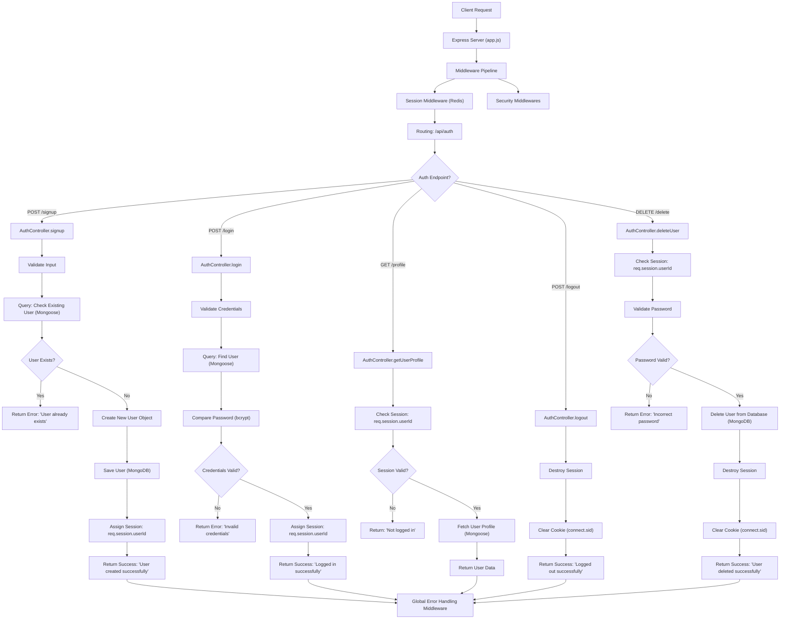

### Backend Architecture

```mermaid
flowchart TD
  %% Client Request & Express Server Setup
  A["Client Request"]
  A --> B["Express Server (app.js)"]
  B --> C["Middleware Pipeline"]
  C --> D["Session Middleware (Redis)"]
  C --> E["Security Middlewares"]
  D --> F["Routing: /api/auth"]
  F --> G{"Auth Endpoint?"}

  %% Signup Flow (POST /signup)
  G -- "POST /signup" --> H["AuthController.signup"]
  H --> I["Validate Input"]
  I --> J["Query: Check Existing User (Mongoose)"]
  J --> K{"User Exists?"}
  K -- "Yes" --> L["Return Error: 'User already exists'"]
  K -- "No" --> M["Create New User Object"]
  M --> N["Save User (MongoDB)"]
  N --> O["Assign Session: req.session.userId"]
  O --> P["Return Success: 'User created successfully'"]

  %% Login Flow (POST /login)
  G -- "POST /login" --> Q["AuthController.login"]
  Q --> R["Validate Credentials"]
  R --> S["Query: Find User (Mongoose)"]
  S --> T["Compare Password (bcrypt)"]
  T --> U{"Credentials Valid?"}
  U -- "No" --> V["Return Error: 'Invalid credentials'"]
  U -- "Yes" --> W["Assign Session: req.session.userId"]
  W --> X["Return Success: 'Logged in successfully'"]

  %% Profile Flow (GET /profile)
  G -- "GET /profile" --> Y["AuthController.getUserProfile"]
  Y --> Z["Check Session: req.session.userId"]
  Z --> AA{"Session Valid?"}
  AA -- "No" --> AB["Return: 'Not logged in'"]
  AA -- "Yes" --> AC["Fetch User Profile (Mongoose)"]
  AC --> AD["Return User Data"]

  %% Logout Flow (POST /logout)
  G -- "POST /logout" --> AE["AuthController.logout"]
  AE --> AF["Destroy Session"]
  AF --> AG["Clear Cookie (connect.sid)"]
  AG --> AH["Return Success: 'Logged out successfully'"]

  %% Delete User Flow (DELETE /delete)
  G -- "DELETE /delete" --> AJ["AuthController.deleteUser"]
  AJ --> AK["Check Session: req.session.userId"]
  AK --> AL["Validate Password"]
  AL --> AM{"Password Valid?"}
  AM -- "No" --> AN["Return Error: 'Incorrect password'"]
  AM -- "Yes" --> AO["Delete User from Database (MongoDB)"]
  AO --> AP["Destroy Session"]
  AP --> AQ["Clear Cookie (connect.sid)"]
  AQ --> AR["Return Success: 'User deleted successfully'"]

  %% Global Error Handling (applies to all endpoints)
  P --> AI["Global Error Handling Middleware"]
  X --> AI
  AD --> AI
  AH --> AI
  AR --> AI
```

