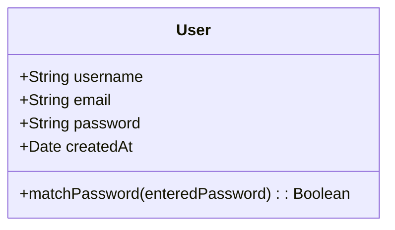
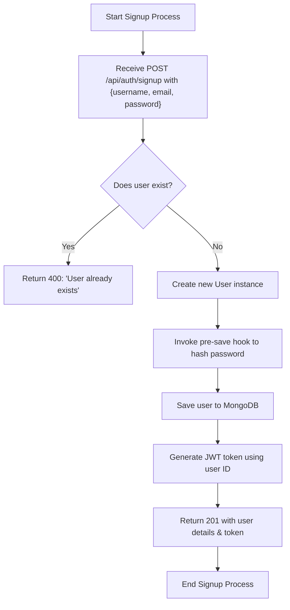
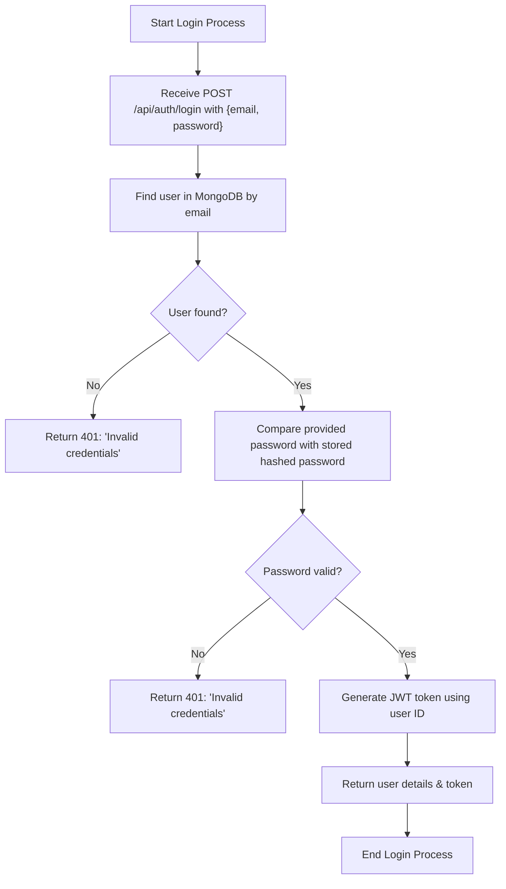
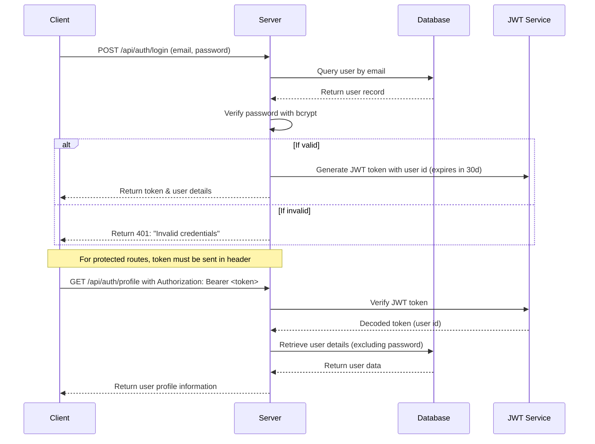

# Node.js Express Authentication API Documentation

## Project Structure

```
backend/
├── config/
│   └── db.js              // MongoDB connection configuration
├── controllers/
│   └── authController.js  // Contains functions: signup, login, getUserProfile
├── middlewares/
│   └── authMiddleware.js  // Middleware for protecting routes (JWT verification)
├── models/
│   └── User.js            // Mongoose schema & model for User (includes password hashing)
├── routes/
│   └── authRoutes.js      // Defines authentication routes
└── server.js              // Main Express server setup and route mounting
```

## Environment Variables

- **MONGO_URL**: MongoDB connection string.
- **JWT_SECRET**: Secret key used for signing JWT tokens.
- **PORT**: Server port (default is 5000).

## Endpoints Overview

- **POST /api/auth/signup**  
  Registers a new user.  
  _Request Body_: `{ username, email, password }`  
  _Response_: User details and a JWT token.

- **POST /api/auth/login**  
  Authenticates an existing user.  
  _Request Body_: `{ email, password }`  
  _Response_: User details and a JWT token.

- **GET /api/auth/profile**  
  Retrieves the profile of the authenticated user.  
  _Headers_: `Authorization: Bearer <JWT>`  
  _Response_: `{ username, email }`

- **GET /api/protected**  
  Example of an additional protected route.  
  _Headers_: `Authorization: Bearer <JWT>`  
  _Response_: Custom welcome message including the username.

## Mermaid Diagrams

### 1. Class Diagram for the User Model

_Explanation:_  
The User model has fields for username, email, password, and createdAt. It also provides a method `matchPassword` to compare the provided password with the stored (hashed) password.

### 2. Flowchart: User Registration (Signup)

_Explanation:_  
When a signup request is received, the server checks if the user exists. If not, it creates a new user, hashes the password (via a pre-save hook), saves the record, generates a JWT token, and returns the user data along with the token.

### 3. Flowchart: User Login Process

_Explanation:_  
The login process verifies the user's existence and compares the provided password with the stored hash. On success, a JWT token is generated and returned along with the user details.

### 4. JWT Authentication & Security Flow (Sequence Diagram)

_Explanation:_  
This diagram illustrates the authentication lifecycle: validating credentials at login, generating and returning a JWT token, and verifying the token for protected endpoints.

## Security Mechanisms

- **Password Hashing:**  
  Passwords are hashed using bcrypt before storage. The pre('save') hook in the User model ensures that raw passwords aren’t stored.

- **JWT-Based Authentication:**  
  A JWT token is generated on successful login or signup. The token encodes the user’s ID, is signed with **JWT_SECRET**, and expires after 30 days.

- **Protected Routes:**  
  Protected routes use middleware (e.g., `protect`) to validate the token from the Authorization header. If the token is missing or invalid, a 401 error is returned.

## Usage Instructions

### Install Dependencies

```bash
npm install express mongoose dotenv bcryptjs jsonwebtoken cors
```

### Configure Environment Variables

Create a `.env` file in your project root with:

```ini
MONGO_URL=your_mongodb_connection_string
JWT_SECRET=your_jwt_secret_key
PORT=5000
```

### Run the Server

Start the server with:

```bash
node backend/server.js
```
Or using nodemon for development:

```bash
nodemon backend/server.js
```

### Testing the Endpoints

Use Postman or curl to interact with the API:

- **Register a new user:** POST `/api/auth/signup`
- **Log in:** POST `/api/auth/login`
- **Retrieve user profile:** GET `/api/auth/profile` (pass JWT in Authorization header)
- **Access protected endpoint:** GET `/api/protected`


