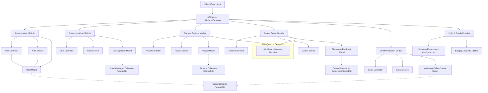

```mermaid
flowchart TD
  %% Client & API Gateway
  A["Client (React App)"]
  A --> B["API Server (Node.js/Express)"]
  
  %% Core Modules within the Server
  B --> C[Authentication Module]
  B --> D[Classroom Chat Module]
  B --> E[Campus Projects Module]
  B --> F[Career Center Module]
  B --> G[Email Verification Module]
  B --> H[Utility & Config Modules]

  %% Authentication Module details
  C --> C1[Auth Controller]
  C --> C2[Auth Service]
  C --> C3[User Model]
  C1 --- C3
  C2 --- C3

  %% Classroom Chat Module details
  D --> D1[Chat Controller]
  D --> D2[Chat Service]
  D --> D3[Message/Note Model]
  
  %% Campus Projects Module details
  E --> E1[Project Controller]
  E --> E2[Project Service]
  E --> E3[Project Model]
  
  %% Career Center Module details
  F --> F1[Career Controller]
  F --> F2[Career Service]
  F --> F3[Discussion/Feedback Model]
  
  %% Email Verification Module details
  G --> G1[Email Controller]
  G --> G2[Email Service]
  G --> G3[Verification Token/Status Model]
  
  %% Database (MongoDB) Collections (dashed lines indicate persistence)
  C3 -.-> I["Users Collection (MongoDB)"]
  D3 -.-> J["Chat/Messages Collection (MongoDB)"]
  E3 -.-> K["Projects Collection (MongoDB)"]
  F3 -.-> L["Career Discussions Collection (MongoDB)"]
  G3 -.-> I

  %% External configuration and containerization
  H --> M[Docker & Environment Configurations]
  H --> N[Logging, Security, Utilities]
  
  %% Optional: Expandability for future campuses
  subgraph Future Expansion [Multi-Campus Expansion]
    direction LR
    O[Additional University Modules]
  end
  E --- O
  F --- O
```
