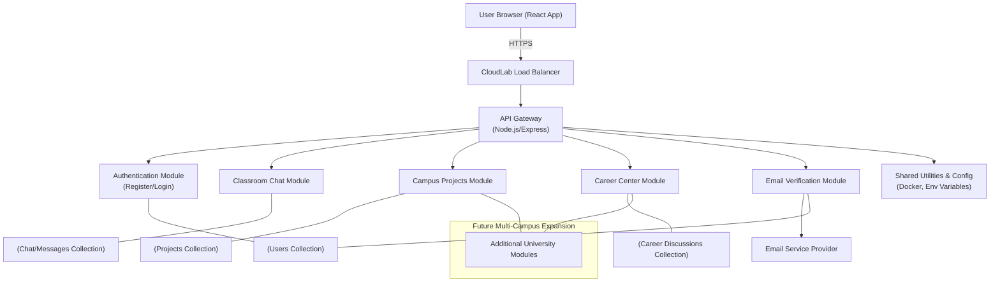

```mermaid
flowchart TD
    %% External Client and CloudLab Load Balancing
    A["User Browser (React App)"]
    A -->|HTTPS| B["CloudLab Load Balancer"]

    %% API Gateway and Modular Server
    B --> C["API Gateway\n(Node.js/Express)"]

    %% Core Modular Services
    C --> D["Authentication Module\n(Register/Login)"]
    C --> E["Classroom Chat Module"]
    C --> F["Campus Projects Module"]
    C --> G["Career Center Module"]
    C --> H["Email Verification Module"]

    %% Email Integration (external service)
    H --> I["Email Service Provider"]

    %% Database Collections (MongoDB)
    D --- J["(Users Collection)"]
    E --- K["(Chat/Messages Collection)"]
    F --- L["(Projects Collection)"]
    G --- M["(Career Discussions Collection)"]
    H --- J

    %% Supporting Services and Config
    C --> N["Shared Utilities & Config\n(Docker, Env Variables)"]

    %% Future Expandability Placeholder
    subgraph Future Expansion ["Future Multi-Campus Expansion"]
      O["Additional University Modules"]
    end
    F --- O
    G --- O
```
