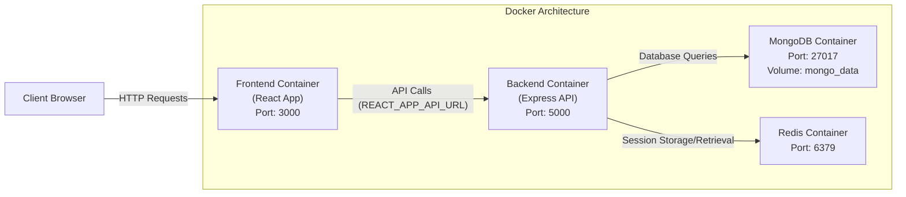

# Project Goal: 
Create an application tailored for university students that enables them to connect, collaborate on projects, share notes, and study together. The app will be functionality similar to Discord but focused on academic and campus collaboration.


# Deployment Instructions
1. Ensure Docker is installed.
2. In the project root, run: 
   ```
   docker-compose up --build
   ```
3. Access the application:
   - Frontend: http://localhost:3000
   - Backend: http://localhost:5000
4. To stop the services, run:
   ```
   docker-compose down
   ```

# Demo Video


https://github.com/user-attachments/assets/3a57d87e-2264-4e75-9dd3-40b85e564b55


# Architecture Design

### Docker Architecture:


### Backend Workflow:
A flowchart describing the backend workflow can be found [here](https://github.com/TylerGeiger513/CloudComputing-Prototype/blob/main/backend/readme.md)
### Frontend Workflow:
A flowchart describing the frontend workflow can be found [here](https://github.com/TylerGeiger513/CloudComputing-Prototype/blob/main/frontend/readme.md)


# Project Structure
  
   
(Backend )[]
The file structure is listed below 
```plaintext
├── .dockerignore               # Files and folders to ignore during Docker builds
├── docker-compose.yml          # Orchestrates backend, frontend, MongoDB, and Redis containers
│
├── backend                     # Express API (Node.js)
│   ├── .env.development        # Environment variables for development
│   ├── Dockerfile.backend      # Dockerfile for the backend container
│   ├── app.js                  # Main Express application setup
│   ├── server.js               # Entry point to start the backend server
│   │
│   ├── config                  # Configuration files
│   │   ├── config.js           # Loads and exports environment configurations
│   │   ├── db.js               # MongoDB connection using Mongoose
│   │   ├── redisClient.js      # Configures and connects to the Redis client
│   │   └── sessionStore.js     # Session middleware configuration using Redis
│   │
│   ├── controllers             # Request handlers for business logic
│   │   └── authController.js   # Handles authentication: signup, login, logout, delete
│   │
│   ├── middleware              # Custom middleware for the API
│   │   ├── authMiddleware.js   # Protects routes by checking session validity
│   │   ├── errorHandler.js     # Global error handler for the backend
│   │   └── logging.js          # Logs incoming requests using winston
│   │
│   ├── validators              # Input validation logic
│   │   └── authValidator.js    # Validation rules for authentication endpoints
│   │
│   ├── models                  # Mongoose models
│   │   └── User.js             # Defines the User schema and password hashing
│   │
│   ├── routes                  # Express route definitions
│   │   └── authRoutes.js       # Routes for authentication endpoints (/signup, /login, etc.)
│   │
│   ├── logs                    # Directory for log files (e.g., error.log)
│   │
│   └── tests                   # Integration and endpoint tests
│       └── auth.test.js        # Tests for authentication endpoints using Supertest
│
└── frontend                    # React application (Client-side)
    ├── .env.development        # Frontend-specific environment variables (e.g., API URL)
    ├── Dockerfile.frontend     # Dockerfile for the frontend container
    │
    ├── public                  # Static assets and HTML template
    │   └── index.html          # Main HTML file loaded by the browser
    │
    └── src                     # React source code
        ├── App.js              # Main React component (application bootstrap)
        │
        ├── components        # Reusable UI components
        │   ├── forms         # Form components for authentication
        │   │   ├── Login.js              # Login form component
        │   │   ├── Signup.js             # Signup form component
        │   │   ├── login.module.css      # CSS modules for Login styles
        │   │   └── signup.module.css     # CSS modules for Signup styles
        │   │
        │   └── layout        # Layout components
        │       ├── Header.js             # Top navigation/header component
        │       ├── Header.module.css     # Styles for Header
        │       └── ParticleBackground.js # Animated particle background component
        │
        ├── context           # React Context for global state management
        │   ├── authContext.js  # Provides authentication state and functions
        │   └── themeContext.js # Handles light/dark theme toggling
        │
        ├── pages             # Page-level components
        │   ├── Dashboard.js  # Dashboard page for logged-in users
        │   └── Profile.js    # User profile page
        │
        ├── routes            # Application routing configuration
        │   └── Routes.js     # Defines public and protected routes using React Router
        │
        ├── services          # API service modules
        │   └── authService.js  # Functions to call backend authentication endpoints
        │
        └── styles            # Global styles and theme definitions
            ├── App.css       # Global application styles
            ├── index.css     # Base CSS resets and styles
            └── themes.js     # Definitions for light and dark theme variables
```

-- 
# Project Planning

## 1. Authentication & Authorization (Login)
- [x] Implement user registration and login endpoints.
- [x] Manage sessions using Redis.
- [x] Protect secure routes with authentication middleware.
- [x] Implement password hashing and credential verification.
- [ ] *(Optional)* Add email verification and password reset flows.

## 2. Friend System (Add & Connect with Users)
- [ ] Define a friend request model with statuses (pending, incoming, accepted).
- [ ] Extend the User model to include friend lists or reference relationships.
- [ ] Create an endpoint to send friend requests.
- [ ] Create endpoints to accept or decline friend requests.
- [ ] Create an endpoint to fetch a user's friend list.
- [ ] Design friend request notifications or alerts.
- [ ] Build a view to manage incoming friend requests and display friend lists.

## 3. Direct Messaging System
- [ ] Create API endpoints for sending and retrieving messages between users.
- [ ] Design a message model (sender, recipient, timestamp, message content).
- [ ] Implement message persistence storing messages in MongoDB.
- [ ] Build a prototype UI for direct messages between friends.
- [ ] Integrate messaging inputs and load message history.

## 4. Live Messaging (Real-time Updates)
- [ ] Integrate WebSockets (e.g., using Socket.IO) to enable live message broadcasting.
- [ ] Configure the backend to push real-time updates to connected clients.
- [ ] Update the direct messaging UI to listen for and display real-time events.
- [ ] Ensure new messages appear instantly without needing a full page refresh.

## 5. University Group Chat
- [ ] Develop API endpoints for joining university groups.
- [ ] Allow users to join or leave groups.
- [ ] Implement features such as group descriptions and member lists.
- [ ] Build a group chat UI similar to direct messaging.
- [ ] Reuse or extend the live messaging system for group conversations.
- [ ] Manage group-specific notifications.

## 6. Classroom/Group Subgroups
- [ ] Design API endpoints for creating subgroups within a university group or classroom.
- [ ] Define subgroup roles and permissions (e.g., teacher, student).
- [ ] Develop a UI component for browsing and joining available subgroups.
- [ ] Integrate subgroup chat functionality, leveraging existing group chat logic.
- [ ] Allow subgroup moderators to manage membership and content.

---

## Deployment Planning

    1. Prepare environment files `.env.production`
    
    2. Set production-required variables (e.g., `NODE_ENV=production`, production MongoDB/Redis connection strings, secure cookies, etc.).
    
    3. Update Dockerfiles for production builds
    
    4. Create a `docker-compose.production.yml` 

    5. Configure Cloudlab Environment

    6. Proxy (NGINX) & SSL

    7. Do the same for staging environment 
